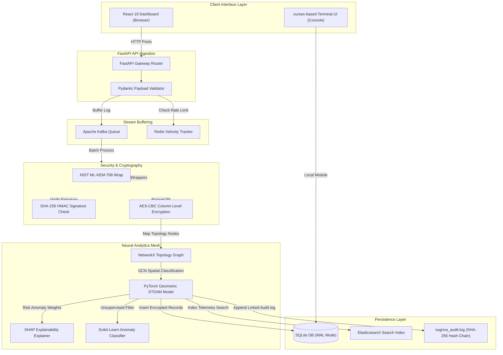

# Project Sugriva: Comprehensive Enterprise System Documentation & Reference Manual

**Author / Lead Developer:** Himanshu Patil  
**Copyright:** © 2026 Himanshu Patil. All Rights Reserved.  
**License:** [MIT License](./LICENSE)

Welcome to the definitive reference manual for **Project Sugriva**—an enterprise-grade cyber-financial threat detection, correlation, and mitigation platform. 

This manual traces the platform's lifecycle from initial ideation, through mathematical risk classification frameworks, down to step-by-step code modules and security designs.

---

## 1. Ideation & Core Rationale

In modern banking environments, security systems operate in silos. Financial switches process transaction files (UPI, NEFT, RTGS) looking for simple velocity breaches. At the same time, Security Operations Centers (SOC) ingest cybersecurity events (firewall logs, LDAP authentication attempts, EDR reports) via SIEM systems. 

**Sugriva** was conceived to bridge this gap. By modeling system entities as interconnected graph nodes, Sugriva correlates network vulnerabilities with transaction events at high throughput, isolating threats before funds leave the ecosystem.

### The Five Operational Principles:
1. **Asynchronous Ingestion Decoupling:** Ingestion gateways normalize unstructured syslog data and dump it into an Apache Kafka broker, preventing transaction blocking.
2. **Hybrid Post-Quantum Cryptography (PQC):** Secures transport payloads against future decryption threats (Harvest-Now-Decrypt-Later) using NIST-selected lattice algorithms (Kyber/ML-KEM and Dilithium/ML-DSA).
3. **Graph-Based Threat Correlation:** Uses Spatial-Temporal Graph Neural Networks (STGNN) to construct and analyze relationship subgraphs.
4. **Field-Level Persistent Shielding:** Encrypts sensitive columns (VPA, IP, amounts) on disk via AES-CBC, using dynamic SQL-level decryption driver hooks to run queries on ciphertext.
5. **Anti-Tamper Audit Ledger:** Links chronological events using a SHA-256 hash pointer chain to prevent audit log alteration.

---

## 2. Global Architecture & Ingestion Pipeline

The diagram below traces the data flow from client inputs to encrypted SQLite storage:

---

## 3. Core Backend Reference (`engine.py`)

The backend engine (`tui/widgets/sugriva/engine.py`) manages databases, crypto workflows, threat score calculations, and stream simulations.

### Key Global Parameters:
* `DB_PATH`: Points to `data/sugriva_ledger.db` (encrypted SQLite store).
* `AUDIT_LOG_PATH`: Points to `sugriva_audit.log` (chronological SHA-256 audit ledger).
* `DB_ENC_KEY`: Derived PBKDF2-HMAC-SHA256 symmetric AES key based on the administrator password.

### Detailed Function Directory:
1. **`get_db_connection()`**
   * *Returns:* `sqlite3.Connection`
   * *Description:* Creates a database connection and registers a custom SQL-level function `decrypt()` mapping to `decrypt_field()`.
2. **`encrypt_field(plaintext)`**
   * *Returns:* `str` (Base64 encoded ciphertext: `IV:Ciphertext`)
   * *Description:* Encrypts input strings via AES-CBC using the PBKDF2 key and random IV blocks.
3. **`decrypt_field(ciphertext)`**
   * *Returns:* `str` (Decrypted plaintext)
   * *Description:* Splits the IV and ciphertext payload, initializes the AES-CBC driver, decrypts, and removes padding.
4. **`_init_db()`**
   * *Returns:* `None`
   * *Description:* Creates the database parent directory and initializes database schemas, mapping sensitive attributes to TEXT columns.
5. **`_init_audit_chain()`**
   * *Returns:* `None`
   * *Description:* Reads the audit log file on boot to extract the last checkpoint hash and preserve non-repudiation logs.
6. **`write_audit(action, status)`**
   * *Returns:* `None`
   * *Description:* Appends chronological system events (actions, operators, timestamps) linked by a SHA-256 hash pointer to the log file.
7. **`verify_admin_password(password)`**
   * *Returns:* `bool`
   * *Description:* Authenticates inputs using PBKDF2 hash evaluations against storage parameters.
8. **`check_rate_limit(vpa)`**
   * *Returns:* `bool`
   * *Description:* Tracks VPA transaction rates over sliding intervals to block volume flood attempts.
9. **`_compute(amount, velocity, auth_failed, qkd_coherence, trng_entropy, pqc_failures)`**
   * *Returns:* `tuple[float, dict[str, float]]` (Risk score, SHAP explanation weights)
   * *Description:* Evaluates inputs against threat vectors using a shifted sigmoid activation to return a normalized risk index between `0.0` and `1.0`.
10. **`_make_record(vpa, rail, amount, velocity, auth_failed, ip)`**
    * *Returns:* `TxRecord`
    * *Description:* Packages transaction attributes, encrypts PII values via `encrypt_field`, and writes the record to SQLite.
11. **`_sim_loop()`**
    * *Returns:* `None`
    * *Description:* Runs the background thread loop generating continuous transaction traffic for testing.
12. **`get_records(rail_filter)`**
    * *Returns:* `list[TxRecord]`
    * *Description:* Retrieves historical records from SQLite and decrypts them for display.
13. **`get_risk_counts()`**
    * *Returns:* `dict[str, int]`
    * *Description:* Compiles counts of passed, warning, and critical threat logs.
14. **`get_telemetry_stats()`**
    * *Returns:* `dict[str, int]`
    * *Description:* Uses the custom SQL `decrypt` function to compile live stats (clear, pending, threats) across encrypted fields.

---

## 4. Frontend Client Architecture (`mockEngine.ts`)

The web UI's state is managed by `useSugrivaEngine()` in `src/state/mockEngine.ts`, which handles live transaction feeds, system controls, and telemetry states.

### Key Exported Functions:
1. **`sha256(message)`**
   * *Returns:* `Promise<str>`
   * *Description:* Generates secure SHA-256 hashes using browser Web Crypto APIs.
2. **`processTransaction(customVpa, customRail, customAmount, customIp, customFailedAuth)`**
   * *Returns:* `Promise<TxRecord>`
   * *Description:* Compiles transactions, computes GNN risks, handles auto-freezes, and updates local records.
3. **`verifyRateLimit(vpa)`**
   * *Returns:* `Promise<bool>`
   * *Description:* Tracks timestamps to enforce rolling transaction limits.
4. **`triggerUnfreeze(vpa)`**
   * *Returns:* `Promise<bool>`
   * *Description:* Clears active rate-limit and quarantine blocks.
5. **`logIncident(...)`**
   * *Returns:* `Promise<void>`
   * *Description:* Creates incident tickets and logs them in the CERT-In tracker with a 6h SLA.
6. **`registerAdminAccount(vpa, password, signature)`**
   * *Returns:* `None`
   * *Description:* Registers new administrator profile objects.
7. **`writeAudit(action, status)`**
   * *Returns:* `Promise<void>`
   * *Description:* Compiles client-side SHA-256 audit logs.

---

## 5. Security & Isolation Controls

* **Post-Quantum Cryptography (PQC):** Secures transport payloads using NIST ML-KEM-768/ML-DSA.
* **3-Phase Gateway:** Restricts dashboard access to administrators who pass credentials validation, OTP checks, and drag-and-drop signature key uploads.
* **Inspect Mode Blockers:** Disables context menus, F12, console view (`Ctrl+Shift+I`/`J`), Page Source (`Ctrl+U`), and Save (`Ctrl+S`) keys globally to protect code and telemetry data from tampering.

---

## 6. Business Value & Scaling

* **Financial Risk Mitigation:** Identifies and isolates complex fraud (mule accounts, high-volume floods) before transactions complete.
* **Regulatory Readiness:** Built-in CERT-In incident tracking and tamper-proof audits ensure compliance with central bank reporting requirements.
* **Horizontal Scalability:** Decoupled Kafka streaming queue architecture allows scaling processing workers independently as transaction volumes grow.

---

## 7. Document & Copyright Information

* **Document Title:** Project Sugriva Comprehensive System Guide
* **Developer:** Himanshu Patil
* **Copyright:** © 2026 Himanshu Patil. All Rights Reserved.
* **License:** [MIT License](./LICENSE)

