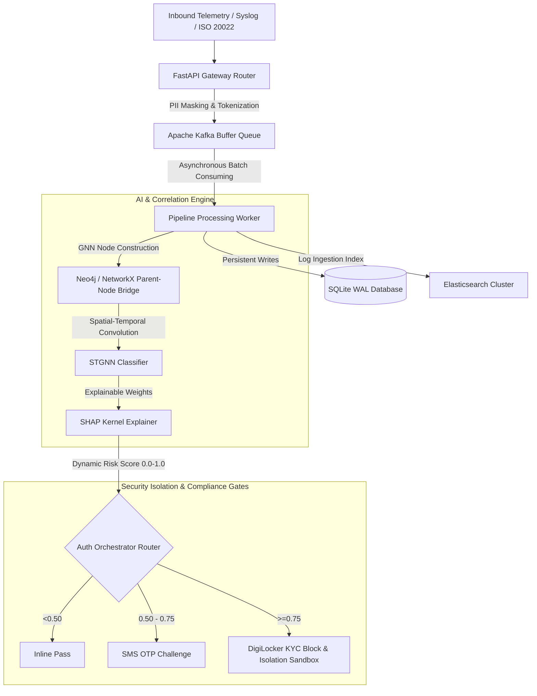
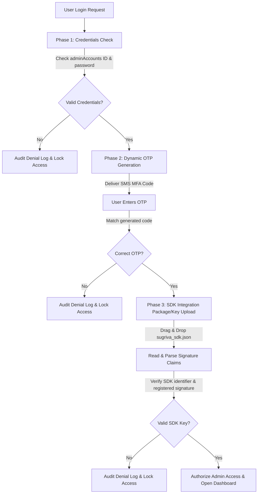
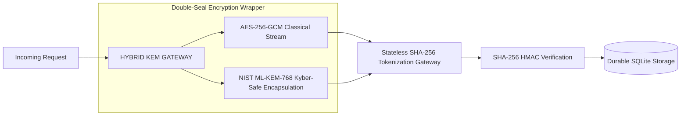
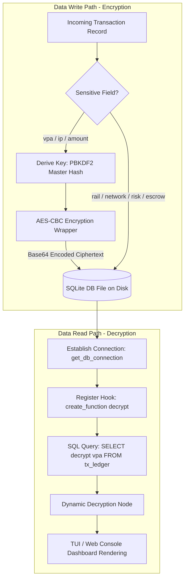
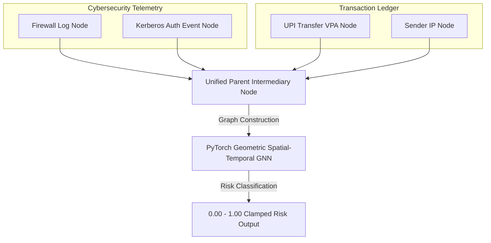
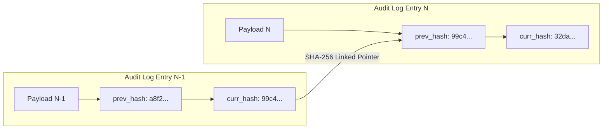

# Project Sugriva: Enterprise Cyber-Financial Threat Correlation & Mitigation Engine

**Author / Lead Developer:** Himanshu Patil  
**Copyright:** © 2026 Himanshu Patil. All Rights Reserved.  
**License:** [MIT License](./LICENSE)

Project Sugriva is a high-throughput cyber-financial threat detection, telemetry ingestion, and mitigation platform. It combines asynchronous streaming ingestion, advanced cryptographic filtering, graph-based topological correlation, and post-quantum safe layers to isolate risk in real time.

For an exhaustive guide detailing every function, data flow mapping, and complete technology specs, refer to the **[Enterprise Reference & Technical Specifications Manual](file:///c:/Users/Priyanshu%20Patil/Documents/program01/sugriva/SYSTEM_REFERENCE.md)** or read the comprehensive system manual in **[COMPREHENSIVE_GUIDE.md](file:///c:/Users/Priyanshu%20Patil/Documents/program01/sugriva/COMPREHENSIVE_GUIDE.md)**.

### 🔗 External Project Media & Resources:
* **[Project Demonstration Video (Google Drive)](https://drive.google.com/file/d/15Ad03_hbdUpX0d7f3CzSAi242779vof7/view?usp=sharing)**
* **[Project Functional Documentation (Google Docs)](https://docs.google.com/document/d/1Bl6Vi7zeb_eZAWXHxQvKc-hR3VPZf3NzulYtplEDmcE/edit?usp=sharing)**

---

## 1. System Architecture & Telemetry Pipeline



---

### 1.1. 3-Phase Multi-Factor Access Gateway

Sugriva enforces a strict multi-tier verification process for administrative terminal access:



---

## 2. Hybrid Post-Quantum Cryptographic Gateway

Sugriva implements a forward-proof **Hybrid Key Encapsulation Mechanism (KEM) Gateway** to thward Harvest-Now-Decrypt-Later (HNDL) sweeps while retaining legacy performance compliance.



---

### 2.1. SQLite Cryptographic Database Shielding

Sugriva implements field-level AES-CBC database encryption for sensitive transaction data fields (VPAs, IP addresses, transaction amounts) stored on disk, and decodes them dynamically during read queries:



---

## 3. Dynamic Parent-Node GNN Correlation Mesh

To bridge unstructured cybersecurity network events (Splunk logs, EDR metrics, firewall logs) with transaction records (UPI, NEFT, RTGS) at low latency, the system uses a **Parent Intermediary Node** abstraction layer:



---

## 4. Immutable Cryptographic Hashing Chain (Non-Repudiation)

Audit logs are cryptographically linked in a private chain structure. Tampering with any historical entry breaks the hash validation throughout the entire log history:



---

## 5. Sliding Window Velocity Rate-Limiter

To defend core banking switches from distributed high-frequency transaction floods (DDoS simulations), Sugriva utilizes a Redis-backed sliding-window limit model:

```mermaid
gantt
    title 5-Second Sliding Rate Limiting Window (Max 3 Transactions)
    dateFormat  X
    axisFormat %s
    section Requests
    TX 1 (Allowed)   :active, 0, 1
    TX 2 (Allowed)   :active, 2, 3
    TX 3 (Allowed)   :active, 4, 5
    TX 4 (BLOCKED)   :crit, 4, 5
```



---

## 6. Core Modules & Functionalities

### 1. Ingestion Layer (`app/ingestion.py`)
*   **FastAPI Router:** Exposes `/api/v1/telemetry/process-raw` to receive telemetry payloads.
*   **Regex Normalizer:** Extracts core network and metadata fields from raw Syslog formatting.
*   **ISO 20022 XML Parser:** Parses structured financial transaction messages (NEFT/RTGS SFMS architectures).
*   **Buffer Ingestion:** Asynchronously writes normalized events to Apache Kafka using `aiokafka` with Gzip compression and a 10ms linger interval.

### 2. Cryptographic Security Gateway (`app/crypto.py`)
*   **PII Tokenization:** Salted SHA-256 tokenization to scrub PANs, VPAs, and client credentials.
*   **Encryption at Rest:** AES-256-GCM authenticated encryption/decryption routines for sensitive payload fields.
*   **Message Integrity:** SHA-256 HMAC verification pipeline ensuring zero-tampering.
*   **Post-Quantum Agility:** Dynamic agility wrappers wrapping classical algorithms with NIST-standardized Kyber/Dilithium.

### 3. Persistent Storage Layer (`app/storage.py`)
*   **SQLite Ledger:** Highly tuned SQLite layout configured with Write-Ahead Logging (WAL) and synchronous mode turned off.
*   **Redis Velocity Engine:** Utilizes Redis sorted sets (`ZADD` / `ZCOUNT`) to compute rolling 3-second transactional frequencies per user.
*   **Elasticsearch Security Index:** Indexes all parsed fields into `sugriva-security-index` for high-velocity query and analytic search capabilities.

### 4. Neural Analytics Mesh (`app/analytics.py`)
*   **In-Memory Graph Topology:** Maps network IP addresses, session tokens, and financial endpoints into `networkx` graphs linked via a central `BRIDGE-telemetry_id` node.
*   **Unsupervised Anomaly Isolation:** Employs a scikit-learn `IsolationForest` to act as a sandbox filter.
*   **Spatial-Temporal Graph Neural Network (STGNN):** PyTorch Geometric implementation using GCN layers to output risk scores.
*   **Explainable AI (XAI):** Linear SHAP kernel explainer resolving exact feature attribution weights.

---

## 7. Configuration Specifications

| Environment Variable | Default Value | Description |
|---|---|---|
| `KAFKA_BOOTSTRAP_SERVERS` | `localhost:9092` | Broker address |
| `REDIS_URL` | `redis://localhost:6379/0` | Key-value store endpoint |
| `SQLITE_DB_PATH` | `./data/sugriva_vault.db` | Persistence database location |
| `ELASTICSEARCH_URL` | `http://localhost:9200` | Analytics search server endpoint |
| `CRYPTO_HMAC_SECRET` | *(HMAC hex)* | Signature validation key |
| `TOKEN_SALT` | `SUGRIVA_SALT_2026` | Tokenization salt |
| `KAFKA_TOPIC` | `sugriva-raw-telemetry` | Destination stream queue |
| `SYSTEM_PORT` | `8000` | FastAPI server listener port |

---

## 8. Setup & Execution Instructions (Web GUI & Terminal TUI)

### 1. Prerequisites
* **Docker & Docker Compose** (to orchestrate Kafka, Redis, and Elasticsearch containers)
* **Python 3.10+** (for backend engines)
* **Node.js 18+ & npm** (for compiling the React dashboard)

---

### 🚀 Launching the Web GUI Portal (Web App)

Follow these steps to launch the security gateway, backend daemon, and browser-based control panel:

#### Step A: Spin Up Backing Services
Launch the Docker container stack (Kafka, Redis, Elasticsearch):
```bash
docker-compose up -d
```

#### Step B: Start the Backend Daemon Orchestrator
Open a terminal, activate your virtual environment, and run the Python orchestrator daemon:
* **Windows (PowerShell):**
  ```powershell
  python -m venv venv
  .\venv\Scripts\Activate.ps1
  pip install -r requirements.txt
  python run_mvp.py
  ```
* **Linux / macOS:**
  ```bash
  python -m venv venv
  source venv/bin/activate
  pip install -r requirements.txt
  python run_mvp.py
  ```
*(This initializes the database schema, seeds mock records, and boots the FastAPI server on port `8000`)*

#### Step C: Start the React Web Client
Open a second terminal window, navigate to the web directory, install node packages, and run the Vite compiler:
```bash
cd sugriva-web
npm install
npm run dev
```
Open **[http://localhost:3000/](http://localhost:3000/)** in your browser to access the Sugriva control center.

---

### 🖥️ Launching the Standalone Terminal UI (TUI)

If you are running in a low-resource server terminal or command line, you can launch the curses TUI directly:

#### Step A: Activate Virtual Environment
Open a terminal and activate the project's Python virtual environment:
* **Windows (PowerShell):**
  ```powershell
  .\venv\Scripts\Activate.ps1
  ```
* **Linux / macOS:**
  ```bash
  source venv/bin/activate
  ```

#### Step B: Launch the TUI Curses Application
Run the standalone Textual demo script directly from the project root:
```bash
python tui_template/run_demo.py
```
*(This starts the interactive, keyboard-driven curses threat monitor and command terminal)*

---

## 9. Sugriva Textual TUI Console Commands

The advanced Textual dashboard (`tui_template/run_demo.py`) features the following built-in console commands on the main input line:

| Command | Action / Description | Example |
| :--- | :--- | :--- |
| `help` | Outputs console command definitions menu. | `help` |
| `login admin <password>` | Secure PBKDF2-HMAC authentication to switch to ADMIN. (Pwd: `adminpassword`). | `login admin adminpassword` |
| `login analyst` | Transitions role permissions back to ANALYST (view-only mode). | `login analyst` |
| `fetch <vpa>` | Queries SQLite ledger history for VPA node. | `fetch user_1120@bank` |
| `breaker [trip/reset]` | Trip OPEN or reset CLOSED the security circuit breaker (ADMIN). | `breaker trip` |
| `set threshold <float>` | Updates GNN risk score containment threshold (ADMIN). | `set threshold 0.80` |
| `Ctrl+1` / `Ctrl+2` / `Ctrl+3` | Shortcut keys to inject stuffing (`1`), G-Sec liquidation (`2`), or transaction floods (`3`) (ADMIN). | (Press keys) |
| `Ctrl+4` | Shortcut key to inject **Quantum Attack** (coherence collapse & entropy drain) (ADMIN). | (Press keys) |

---

## 10. Web-Based Sugriva Control Center (`sugriva-web/`)

Sugriva incorporates a high-fidelity, flat-design Web UI mapping all TUI features into a premium browser-based interface.

### Technical Web Stack
* **Framework:** React + Vite + TypeScript
* **Animations:** Framer Motion (for fluid tab-swapping and spinning QKD quantum indicators)
* **Styling:** Vanilla CSS (no Tailwind, no gradients; absolute flat high-contrast design)
* **Branding Font:** Orbitron (Google Fonts)

### High-Contrast Visual Design
* **Primary Contrast:** White backdrop (`#ffffff`/`#fcfcfc`) bounded by clean gray dividers, utilizing Safety Orange (`#ff6600`) for active tabs, input borders, and badge outlines.
* **Positive Feedback Tints:** Verified clear transactions and manual overrides render in a deep green font (`#009933`) over a light green tint background panel (`#e6ffe6`).
* **Active Mule Indicators:** Suspected mule accounts isolated by GNN node correlation render in magenta (`#cc00cc`) over soft background tint (`#ffe6ff`).

### Core Interactive Workspaces
1. **Telemetry Log:** Real-time filtered payments grid.
2. **Security Mesh:** Animated SVG connections detailing `Account VPA -> [BRIDGE] -> IP`.
3. **Auth steps:** RBI-compliant compliance gateways (Inline vs SMS OTP vs DigiLocker KYC).
4. **Database Search:** Fuzzy accounts registry with one-click administrative unfreeze override triggers.
5. **Crypto logs:** Stateless SHA-256 tokens, HMAC integrity validations, and AES-256 ciphers.
6. **Quantum guard:** Active coherence metrics, hardware TRNG entropy bits, and ML-KEM/ML-DSA speed.
7. **Audits & Incidents:** Verifiable SHA-256 chained audit logs and CERT-In 6-Hour SLA countdown timers.

### Web Console Commands
Type commands directly in the navbar terminal input line:
* `login admin adminpassword` — Elevates active role to ADMIN.
* `login analyst` — Downgrades active role to ANALYST.
* `logout` — Resets administrative credentials back to read-only tier.
* `unfreeze <vpa>` — Override quarantine locks on frozen account nodes (ADMIN).
* `breaker [trip/reset]` — Toggle security circuit breaker fail-closed gates (ADMIN).
* `set threshold <float>` — Alter GNN isolation limit on the fly (ADMIN).

### Running the Web Application
Navigate to the web project subdirectory, install dependencies, and launch Vite dev:
```bash
cd sugriva-web
npm install
npm run dev
```
Open **[http://localhost:3000/](http://localhost:3000/)** in your browser.
Trigger attack injections using the footer click panels or press keyboard shortcuts (`Ctrl+1` through `Ctrl+4`).

---

## 11. System Walkthrough Gallery (Screenshots & Recordings)

### 🎥 Operational Walkthrough & Demonstration Video
*Demonstrates dynamic transaction flows, GNN classifications, control panel overrides, and the multi-factor gateway:*

https://github.com/himanshu-anonymous/sugriva/assets/media/demo_video
[View Operational Simulation MP4 Video](./media%20readme/Screen%20Recording%202026-07-16%20225630.mp4)

---

### 🛡️ 3-Phase Multi-Factor Access Gateway

#### Phase 1: VPA Credentials Authentication
*Admin verifies identity using registered credential sets via PBKDF2 hash validation.*


#### Phase 2: MFA OTP Challenge Verification
*Generates and matches 6-digit dynamic OTP verification tokens.*


#### Phase 3: local SDK License Package Verification
*Validates compliance headers and hardware signature metrics in the uploaded JSON license.*


#### Access Authorized & Gateway Handshake Complete
*Grants dashboard access once signatures are validated successfully.*


---

### 🖥️ Web-Based Sugriva Control Center

#### Telemetry Logs & Risk Classification Stream
*Streams payments, displaying white rows for normal nodes, yellow for warnings, and red for isolated risk nodes.*


#### Real-Time Security Mesh Graph
*Maps transaction topologies, displaying live connections between VPA, transaction event, and IP nodes.*


#### Active Threat Mitigation Control Panel
*Gives administrators interactive controls over the threat simulation and system thresholds.*


#### Developer Tools Inspect Mode Intercepted
*Global capture-phase blockers intercept browser DevTools requests to secure client-side views.*


---

### 📟 curses-Based Terminal UI Dashboard

#### Standalone Curses Dashboard Workspace
*Renders log status tables and system threat metrics directly inside server terminals.*


#### Cryptographically Chained Audit Ledger
*Pends and logs chronological system actions linked by dynamic SHA-256 integrity hash chains.*


---

## 12. Copyright & Author Information

**Project Sugriva** — Enterprise Cyber-Financial Threat Correlation & Mitigation Engine  
**Developer:** Himanshu Patil  
**Repository:** [https://github.com/himanshu-anonymous/sugriva](https://github.com/himanshu-anonymous/sugriva)  
**Copyright:** © 2026 Himanshu Patil. All Rights Reserved.  
Licensed under the [MIT License](./LICENSE).

