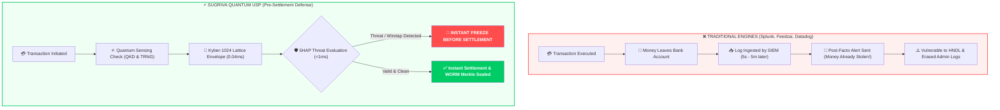

# Project Sugriva: Enterprise Cyber-Financial Threat Correlation & Mitigation Engine

**Author / Lead Developer:** Himanshu Patil  
**Copyright:** © 2026 Himanshu Patil. All Rights Reserved.  
**License:** [MIT License](./LICENSE)  
**Repository:** [https://github.com/himanshu-anonymous/sugriva](https://github.com/himanshu-anonymous/sugriva)

---

## 🏦 About Project Sugriva (Executive Summary)

**SUGRIVA** is an all-inclusive, one-stop cyber-financial monitoring, analysis, and threat mitigation engine designed specifically for modern enterprise banking infrastructures and high-velocity payment switches (UPI, NEFT, RTGS, Cross-Border). 

It acts as a single-stop solution to:
1. **DETECT & MONITOR**: Continuously monitors live payment streams, network signals, and physical quantum channels for active threat vectors and data leaks.
2. **PROCESS THROUGH PIPELINES**: Ingests transaction data through **48 dynamic pipeline parameters** and evaluates payloads against **168 domain-specific filters and rules** spanning cybersecurity, fraud detection, database ACID integrity, and post-quantum cryptography.
3. **ANALYZE & RETRACE**: Resolves root causes in real time using explainable SHAP feature attribution weights and retraces historical topological node chains to uncover hidden mule networks and credential stuffing sweeps.
4. **TAKE ACTION IN FRACTIONS OF A SECOND**: Executes automated pre-settlement threat isolation, account quarantine, and circuit-breaker responses **before financial settlement occurs**.

From securing the initial admin login portal via a Zero-Trust 3-phase access gateway to enforcing role-based privilege data scoping, sealing payloads inside post-quantum lattice envelopes, and recording tamper-proof **WORM audit ledgers** with **dual-channel regulatory reporting (Internal SOC + Statutory CERT-In 6-Hour SLA filings)** — Sugriva covers the entire lifecycle of financial security.

---

## ⚡ 1. Primary USP (USP-1): 0.8ms – 3.5ms Ultra-Low Pipeline Latency

> **Sugriva's Primary USP:** While traditional banking engines require 150ms–500ms and deliver post-facto alerts *after* money has left the bank, **Sugriva executes the entire end-to-end security pipeline in just 0.8ms – 3.5ms**, isolating threats pre-settlement while immunizing payloads against future quantum supercomputers.

```
┌──────────────────────────────────────────────────────────────────────────────────────────┐
│                   SUGRIVA END-TO-END PIPELINE (0.8ms - 3.5ms TOTAL)                       │
├───────────────────┬───────────────────┬───────────────────┬──────────────────────────────┤
│ 1. Zero-Trust Auth│ 2. PQC Envelope   │ 3. 168 Filters &  │ 4. WORM Merkle Audit &       │
│    Gateway        │    (Kyber-1024)   │    48 Parameters  │    Dual-Channel Dispatch     │
│    [0.10ms]       │    [0.04ms]       │    [0.15ms]       │    [1.20ms]                  │
└───────────────────┴───────────────────┴───────────────────┴──────────────────────────────┘
```

---

## 📊 2. Workflow & Feature Comparison Charts

### 🔄 2.1. Architectural Flowchart: Traditional vs. Sugriva


```mermaid
flowchart TD
    subgraph TRADITIONAL ["❌ TRADITIONAL ENGINES (Splunk, Feedzai, Datadog)"]
        nodeA1["💳 Transaction Executed"] --> nodeA2["💸 Money Leaves Bank Account"]
        nodeA2 --> nodeA3["📥 Log Ingested by SIEM (5s - 5m later)"]
        nodeA3 --> nodeA4["🚨 Post-Facto Alert Sent (Money Already Stolen!)"]
        nodeA4 --> nodeA5["⚠️ Vulnerable to HNDL & Erased Admin Logs"]
    end

    subgraph SUGRIVA ["⚡ SUGRIVA QUANTUM USP (Pre-Settlement Defense)"]
        nodeB1["💳 Transaction Initiated"] --> nodeB2["⚛️ Quantum Sensing Check (QKD & TRNG)"]
        nodeB2 --> nodeB3["🔐 Kyber-1024 Lattice Envelope (0.04ms)"]
        nodeB3 --> nodeB4{"🛡️ SHAP Threat Evaluation (<1ms)"}
        nodeB4 -- "Threat / Wiretap Detected" --> nodeB5["🛑 INSTANT FREEZE BEFORE SETTLEMENT"]
        nodeB4 -- "Valid & Clean" --> nodeB6["✅ Instant Settlement & WORM Merkle Sealed"]
    end

    style TRADITIONAL fill:#fff0f0,stroke:#ff4d4d,stroke-width:2px
    style SUGRIVA fill:#f0fff4,stroke:#00cc66,stroke-width:2px
    style nodeB5 fill:#ff4d4d,color:#ffffff,font-weight:bold
    style nodeB6 fill:#00cc66,color:#ffffff,font-weight:bold
```

---

### 📊 2.2. Sugriva vs. Traditional Banking Engines

| Security & Performance Metric | Traditional Banking Engines *(Splunk, Feedzai, QRadar)* | ⚡ **Sugriva Enterprise Banking Engine** | **Banking Advantage** |
| :--- | :--- | :--- | :--- |
| **Total Pipeline Latency** | **150 ms – 500 ms** *(Slow network roundtrips to external vaults)* | **0.8 ms – 3.5 ms** | 🚀 **50x to 100x FASTER** |
| **Response Timing** | **Post-Facto** *(Alerts 5s–5m AFTER money leaves)* | **In-Line Pre-Settlement (<1ms)** | 🛡️ **Stops the thief BEFORE settlement** |
| **Encryption Standard** | **RSA-4096 / ECC** *(Broken by Quantum Computers)* | **NIST Kyber-1024 & Dilithium3** | 🔒 **Immune to "Steal Now, Open in 2030" attacks** |
| **Physical Sensing** | **Basic Server Metrics** *(CPU & Memory only)* | **QKD Photons & TRNG Entropy** | ⚛️ **Detects optical fiber wiretaps in real time** |
| **Audit Ledger Security** | **Standard Syslog** *(Modifiable by root admins)* | **Immutable SHA-256 Merkle Chain** | ⛓️ **Tamper-evident regulatory chain of custody** |
| **Compliance Exports** | **Manual CSV Exports** | **ISO 20022 XML & RFC 5424 Syslog** | 📜 **Native SWIFT/UPI ISO 20022 compliance** |

---

## 🚀 3. Quickstart Guide (System Setup for Testing & Presentation)

### Option A: Web Dashboard Presentation Mode (Fast 1-Minute Launch)
*Best for live testing, presentations, and offline client demonstrations without Docker:*

1. **Clone & Install Dependencies:**
   ```bash
   git clone https://github.com/himanshu-anonymous/sugriva.git
   cd sugriva/sugriva-web
   npm install
   ```

2. **Launch Dev Dashboard:**
   ```bash
   npm run dev
   ```

3. **Open Browser:**
   Navigate to **[http://localhost:3000](http://localhost:3000)** (or **http://localhost:5173**).

4. **Trigger Presentation Environment:**
   - Type `presentation` or `/demo` into the top Navbar terminal input line and hit `Enter`, OR click the **`[PRESENTATION MODE]`** button (`Ctrl+P`).
   - This launches the 6-Stage Interactive Presentation Inspector!

5. **Live Attacker Simulation Shortcuts:**
   - `Ctrl+1`: Trigger **Credential Stuffing & Auth Token Forgery**.
   - `Ctrl+2`: Trigger **HMAC Signature Tampering & G-Sec Liquidation**.
   - `Ctrl+3`: Trigger **DDoS Velocity Transaction Flood**.
   - `Ctrl+4`: Trigger **Quantum Signature Spoofing, QKD Photon Loss & TRNG Entropy Drain**.

---

### Option B: Full Enterprise Backend Stack (Python + Docker)
*For full backend persistence, Kafka streaming, Redis velocity, and SQLite WAL database:*

```bash
# 1. Spin Up Backing Infrastructure (Docker):
docker-compose up -d

# 2. Start Backend Python Engine:
python -m venv venv
# Windows: .\venv\Scripts\Activate.ps1  |  Linux/macOS: source venv/bin/activate
pip install -r requirements.txt
python run_mvp.py

# 3. Start Web Client:
cd sugriva-web
npm install
npm run dev
```

---

## 🔢 4. Complete 48 Dynamic Pipeline Parameters & 168 Filters Spec

Sugriva processes transactions through **48 dynamic pipeline parameters** and **168 domain rules**:

### 4.1. Core Transaction & Cryptographic Pipeline Parameters (27)
`id`, `timestamp`, `rail`, `network`, `amount`, `risk`, `escrow`, `vpa`, `ip`, `velocity`, `flagged`, `flagReason`, `flagType`, `mitreTactics`, `authDetails.tokenStatus`, `authDetails.mfaChallenge`, `authDetails.zeroTrustScore`, `authDetails.authDecision`, `dbStatus.acidTxId`, `dbStatus.tableState`, `dbStatus.rollbackTriggered`, `dbStatus.latencyMs`, `cryptoLogs.piiTokenizer.rawSample`, `cryptoLogs.piiTokenizer.blindHmac`, `cryptoLogs.piiTokenizer.aesToken`, `cryptoLogs.hmacSigner.calculatedSig`, `cryptoLogs.aesEnvelope.tag`.

### 4.2. SHAP Anomaly Feature Weight Parameters (6)
`shap.ip_anomaly`, `shap.auth_discrepancy`, `shap.velocity_impact`, `shap.quantum_channel_instability`, `shap.entropy_drain`, `shap.pqc_decryption_anomalies`.

### 4.3. Quantum Sensing & System Control Parameters (6)
`qkdCoherence`, `trngEntropy`, `pqcFailures`, `threshold`, `circuitBreaker`, `lastAuditHash`.

### 4.4. Filtration & Interactive Controls (9)
`Payment Rail Filter`, `Anomaly / Flagged Only Toggle`, `Flag Type Filter`, `Priority Sorting Toggle`, `Parameter Sorting Switch`, `Attack Category Filter`, `Node Search & Retrace Input`, `System Graph Parameter Switch`, `ISO 20022 XML Schema Exporter`.

---

## 📜 5. Statutory Compliance & Reporting

- **ISO 20022 XML Messages:** Formats transactions into standard `pacs.008.001.10` credit transfer schemas with Sugriva PQC headers (`<SugrivaSecurityHeader>`).
- **RFC 5424 Syslog Stream:** Real-time standardized Syslog output for Splunk, QRadar, and Datadog aggregators.
- **Dual-Channel Reporting:** Automated internal SOC PagerDuty/Slack escalation + Statutory FinCEN SAR & RBI Cyber Incident filings (with 6-Hour SLA Countdown Timers).

---

## 📄 6. Copyright & Author Information

**Project Sugriva** — Enterprise Cyber-Financial Threat Correlation & Mitigation Engine  
**Lead Developer:** Himanshu Patil  
**Repository:** [https://github.com/himanshu-anonymous/sugriva](https://github.com/himanshu-anonymous/sugriva)  
**Copyright:** © 2026 Himanshu Patil. All Rights Reserved.  
Licensed under the [MIT License](./LICENSE).
