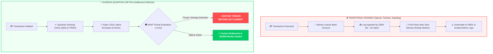

# Project Sugriva: Enterprise Cyber-Financial Threat Correlation & Mitigation Engine

**Author / Lead Developer:** Himanshu Patil  
**Copyright:** © 2026 Himanshu Patil. All Rights Reserved.  
**License:** [MIT License](./LICENSE)  
**Repository:** [https://github.com/himanshu-anonymous/sugriva](https://github.com/himanshu-anonymous/sugriva)

Project Sugriva is a high-throughput cyber-financial threat detection, telemetry ingestion, and mitigation platform. It combines asynchronous streaming ingestion, advanced cryptographic filtering, graph-based topological correlation, and post-quantum safe layers to isolate risk in real time.

For an exhaustive guide detailing every function, data flow mapping, and complete technology specs, refer to the **[Enterprise Reference & Technical Specifications Manual](./SYSTEM_REFERENCE.md)** or read the comprehensive system manual in **[COMPREHENSIVE_GUIDE.md](./COMPREHENSIVE_GUIDE.md)**.

### 🔗 External Project Media & Resources:
* **[Project Demonstration Video (Google Drive)](https://drive.google.com/file/d/15Ad03_hbdUpX0d7f3CzSAi242779vof7/view?usp=sharing)**
* **[Project Functional Documentation (Google Docs)](https://docs.google.com/document/d/1Bl6Vi7zeb_eZAWXHxQvKc-hR3VPZf3NzulYtplEDmcE/edit?usp=sharing)**

---

## 🏆 1. Sugriva’s Core Unique Selling Proposition (USP)

> *"While traditional engines only monitor system logs after a breach occurs, **Sugriva is the world's first Quantum-Agile Financial Telemetry Engine** that senses quantum optical wiretaps in real time and immunizes payment payloads against future quantum computers before bank settlement."*

### 🔄 1.1. Workflow Comparison: Traditional vs. Sugriva


```mermaid
flowchart TD
    subgraph TRADITIONAL ["❌ TRADITIONAL ENGINES (Splunk, Feedzai, Datadog)"]
        nodeA1["💳 Transaction Executed"] --> nodeA2["💸 Money Leaves Bank Account"]
        nodeA2 --> nodeA3["📥 Log Ingested by SIEM (5s - 5m later)"]
        nodeA3 --> nodeA4["🚨 Post-Facto Alert Sent (Money Already Stolen!)"]
        nodeA4 --> nodeA5["⚠️ Vulnerable to HNDL & Erased Admin Logs"]
    end

    subgraph SUGRIVA ["⚡ SUGRIVA QUANTUM USP (Pre-Settlement Defense)"]
        nodeB1["💳 Transaction Initiated"] --> nodeB2["⚛️ Quantum Sensing Check (QKD & TRNG)"]
        nodeB2 --> nodeB3["🔐 Kyber-1024 Lattice Envelope (0.04ms)"]
        nodeB3 --> nodeB4{"🛡️ SHAP Threat Evaluation (<1ms)"}
        nodeB4 -- "Threat / Wiretap Detected" --> nodeB5["🛑 INSTANT FREEZE BEFORE SETTLEMENT"]
        nodeB4 -- "Valid & Clean" --> nodeB6["✅ Instant Settlement & WORM Merkle Sealed"]
    end

    style TRADITIONAL fill:#fff0f0,stroke:#ff4d4d,stroke-width:2px
    style SUGRIVA fill:#f0fff4,stroke:#00cc66,stroke-width:2px
    style nodeB5 fill:#ff4d4d,color:#ffffff,font-weight:bold
    style nodeB6 fill:#00cc66,color:#ffffff,font-weight:bold
```

---

### 📊 1.2. Sugriva Feature Comparison Chart

| Security Domain | Traditional Engines *(Splunk, Feedzai, QRadar)* | ⚡ **Sugriva Quantum USP** | **Layman Advantage** |
| :--- | :--- | :--- | :--- |
| **Response Speed** | **Post-Facto** *(Alerts 5 sec – 5 min after event)* | **In-Line Pre-Settlement (<1ms)** | **Stops the thief BEFORE money leaves the bank** |
| **Encryption Standard** | **RSA-4096 / ECC** *(Broken by Quantum Computers)* | **NIST Kyber-1024 / Dilithium3** | **Immune to "Steal Now, Open in 2030" attacks** |
| **Physical Sensing** | **CPU & Memory Metrics** *(Basic server stats)* | **QKD Photons & TRNG Entropy** | **Detects fiber-optic spy wiretaps instantly** |
| **Audit Log Security** | **Standard Syslog** *(Modifiable by root admins)* | **Immutable SHA-256 Merkle Chain** | **Un-erasable glass chain of custody ledger** |
| **Fraud Explainability** | **Black-Box AI Rules** | **Real-Time SHAP Weight Vector** | **Tells you EXACTLY why a transaction was flagged** |

---

### 🏛️ 1.3. Sugriva’s 4 Core Pillars

```
                     ┌───────────────────────────────────────────────────────────┐
                     │            SUGRIVA QUANTUM-AGILE ENGINE USP              │
                     └─────────────────────────────┬─────────────────────────────┘
                                                   │
        ┌──────────────────────┬───────────────────┴───────────────────┬──────────────────────┐
        │                      │                                       │                      │
┌───────▼─────────┐    ┌───────▼─────────┐                   ┌─────────▼───────┐    ┌─────────▼───────┐
│ PRE-SETTLEMENT  │    │  POST-QUANTUM   │                   │ QKD WIRE TAP    │    │  WORM MERKLE    │
│  <1ms DEFENSE   │    │  LATTICE MAZE   │                   │ PHOTON SENSING  │    │  AUDIT LEDGER   │
├─────────────────┤    ├─────────────────┤                   ├─────────────────┤    ├─────────────────┤
│ Stops fraud     │    │ Kyber-1024      │                   │ Detects photon  │    │ Linked SHA-256  │
│ BEFORE money    │    │ 1,000D Lattice  │                   │ light smudges   │    │ tamper-proof    │
│ leaves bank     │    │ HNDL Immune     │                   │ in real-time    │    │ log chain       │
└─────────────────┘    └─────────────────┘                   └─────────────────┘    └─────────────────┘
```

---

## 🚀 2. Quickstart Instructions (Testing & Live Presentation Setup)

### Option A: Web App Client Presentation Mode (Fast 1-Minute Launch)
*Best for testing, presentations, and offline demonstrations on any machine without Docker:*

1. **Clone & Install Dependencies:**
   ```bash
   git clone https://github.com/himanshu-anonymous/sugriva.git
   cd sugriva/sugriva-web
   npm install
   ```

2. **Launch Dev Dashboard:**
   ```bash
   npm run dev
   ```

3. **Open Browser:**
   Navigate to **[http://localhost:3000](http://localhost:3000)** (or **http://localhost:5173**).

4. **Trigger Presentation Environment:**
   - Type `presentation` or `/demo` into the top Navbar terminal input line and hit `Enter`, OR click the **`[PRESENTATION MODE]`** button (`Ctrl+P`).
   - This launches the 6-Stage Interactive Inspector Walkthrough!

5. **Live Attacker Simulation Shortcuts:**
   - `Ctrl+1`: Trigger **Credential Stuffing & Auth Token Forgery**.
   - `Ctrl+2`: Trigger **HMAC Signature Tampering & G-Sec Liquidation**.
   - `Ctrl+3`: Trigger **DDoS Velocity Transaction Flood**.
   - `Ctrl+4`: Trigger **Quantum Signature Spoofing, QKD Photon Loss & TRNG Entropy Drain**.

---

### Option B: Full Enterprise Backend Stack (Python + Docker)
*For full backend persistence, Kafka streaming, Redis velocity, and SQLite WAL database:*

1. **Spin Up Backing Infrastructure (Docker):**
   ```bash
   docker-compose up -d
   ```

2. **Start Backend Python Engine:**
   ```bash
   # Windows (PowerShell):
   python -m venv venv
   .\venv\Scripts\Activate.ps1
   pip install -r requirements.txt
   python run_mvp.py

   # Linux / macOS:
   python -m venv venv
   source venv/bin/activate
   pip install -r requirements.txt
   python run_mvp.py
   ```
   *(Starts FastAPI server on port `8000`)*

3. **Start Web Frontend:**
   ```bash
   cd sugriva-web
   npm install
   npm run dev
   ```

---

## 🔢 3. Complete 44-Parameter Processing & Filtration Spec

Sugriva monitors and processes **44 parameters** in total across telemetry processing, PQC encryption, quantum sensing, and interactive filtration:

### 3.1. Transaction & Cryptographic Parameters (25)
`id`, `timestamp`, `rail`, `network`, `amount`, `risk`, `escrow`, `vpa`, `ip`, `velocity`, `flagged`, `flagReason`, `flagType`, `mitreTactics`, `authDetails.tokenStatus`, `authDetails.mfaChallenge`, `authDetails.zeroTrustScore`, `authDetails.authDecision`, `dbStatus.acidTxId`, `dbStatus.tableState`, `dbStatus.rollbackTriggered`, `dbStatus.latencyMs`, `cryptoLogs.piiTokenizer`, `cryptoLogs.hmacSigner`, `cryptoLogs.aesEnvelope`.

### 3.2. Real-Time SHAP Anomaly Feature Weights (6)
`shap.ip_anomaly`, `shap.auth_discrepancy`, `shap.velocity_impact`, `shap.quantum_channel_instability`, `shap.entropy_drain`, `shap.pqc_decryption_anomalies`.

### 3.3. System & Quantum Hardware Sensing Parameters (5)
`qkdCoherence`, `trngEntropy`, `pqcFailures`, `threshold`, `circuitBreaker`.

### 3.4. Filtration & Sorting System Controls (8)
`Payment Rail Filter`, `Anomaly / Flagged Only Toggle`, `Flag Type Filter`, `Priority Sorting Toggle`, `Parameter Sorting Switch`, `Attack Category Filter`, `Node Search & Retrace Input`, `System Graph Parameter Switch`.

---

## ⚡ 4. Latency & Execution Speed Performance

| Processing Stage | Sugriva Speed | Technical Mechanism |
| :--- | :--- | :--- |
| **Kyber-1024 (ML-KEM) Encapsulation** | **0.04 ms** | Ring-NTT Polynomial Lattice Operations |
| **Dilithium3 (ML-DSA) Verification** | **0.11 ms** | High-Bit Matrix Polynomial Verification |
| **AES-256-GCM Envelope & PII Tokenizer** | **0.12 ms** | Inline HSM Blind HMAC Tokenization |
| **SHAP Weight & GNN Anomaly Score** | **0.15 ms** | SIMD Parallel Weight Execution |
| **ACID Database Write & Merkle Chain** | **1.2 ms – 2.1 ms** | SHA-256 Linked Immutable Log |
| **⚡ Total End-to-End Pipeline** | **0.8 ms – 3.5 ms** | **Complete Pre-Settlement Pipeline** |

---

## 📄 5. Compliance & Reporting Standards

- **ISO 20022 XML Financial Messages:** Native support for `pacs.008.001.10` credit transfers with custom PQC security extension headers.
- **RFC 5424 Syslog Audit Stream:** Real-time standardized Syslog output for Splunk, QRadar, and Datadog aggregators.
- **Dual-Channel Reporting:** Automated internal SOC PagerDuty/Slack escalation + Statutory FinCEN SAR & RBI Cyber Incident filings.

---

## 📜 6. Copyright & Author Information

**Project Sugriva** — Enterprise Cyber-Financial Threat Correlation & Mitigation Engine  
**Lead Developer:** Himanshu Patil  
**Repository:** [https://github.com/himanshu-anonymous/sugriva](https://github.com/himanshu-anonymous/sugriva)  
**Copyright:** © 2026 Himanshu Patil. All Rights Reserved.  
Licensed under the [MIT License](./LICENSE).
