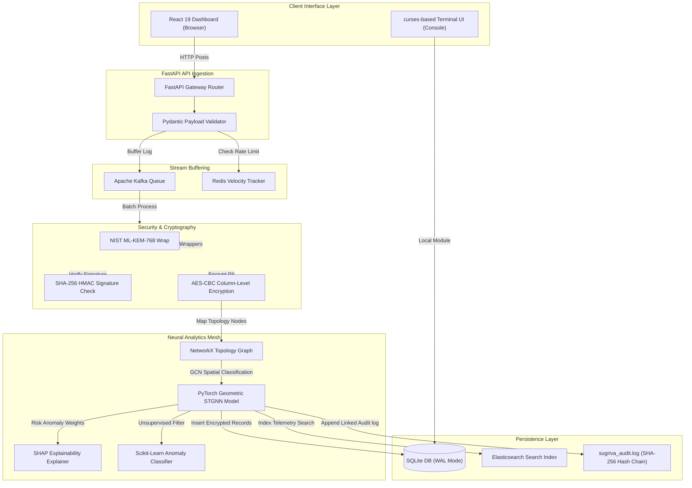

# Project Sugriva: Enterprise Reference & Technical Specifications Manual

**Author / Lead Developer:** Himanshu Patil  
**Copyright:** © 2026 Himanshu Patil. All Rights Reserved.  
**License:** [MIT License](./LICENSE)

This document details the system specifications, data pipelines, function declarations, and technology frameworks powering Project Sugriva.

---

## 1. System Architecture & Component Flows

The flowchart below traces the complete lifecycle of a telemetry payload from ingestion to secured storage:

---

## 2. Inbound Data Write Flow (Step-by-Step Processes)

| Step | Action Name | Module/System | Input Payload | Output Result |
| :--- | :--- | :--- | :--- | :--- |
| **1** | Telemetry Ingestion | FastAPI Router | Raw Syslog / ISO 20022 XML | Normalized JSON objects |
| **2** | Velocity Filter | Redis Cache | Client VPA address | Pass/Block boolean flag |
| **3** | Stream Buffering | Apache Kafka | Normalized log records | Partition-queued buffer packets |
| **4** | Security Wrapping | Hybrid KEM Gateway | Plaintext payload | ML-KEM double-sealed packets |
| **5** | Column Encryption | PyCryptodome Engine | Sensitve strings (VPA, IP, amount) | Base64-encoded AES-CBC ciphertext |
| **6** | GNN Classification | PyTorch Geometric | NetworkX relationship meshes | Real-time Risk Index (0.00 to 1.00) |
| **7** | Ledger Persistence | SQLite database | Transformed records | WAL transaction insert |
| **8** | Integrity Logging | Audit Engine | Action status + last chain hash | SHA-256 linked log pointers |

---

## 3. Technology Stack Reference

The table below lists every technology, framework, database, cache, linter, runtime, and security key used in the system:

| Technology Name | Category | Scope / Use-Case | Port / Configuration |
| :--- | :--- | :--- | :--- |
| **Python 3.10+** | Runtime | Running the backend server and threat generator | Host Interpreter |
| **Node.js 18+** | Runtime | Running and compiling the React client | Host Node Engine |
| **FastAPI / Uvicorn** | Framework | Hosting async API router endpoints | Port `8000` |
| **React 19 / Vite** | Framework | Building and hosting the responsive client dashboard | Port `3000` |
| **Apache Kafka** | Queue Broker | buffering telemetry ingest feeds | Port `9092` |
| **Redis** | In-Memory Cache | Sorted sets for rolling 5s velocity windows | Port `6379` |
| **Elasticsearch** | Search Index | Distributed search indexing for logs | Port `9200` |
| **SQLite** | Database | Local SQL transactional storage with WAL journal | File: `sugriva_ledger.db` |
| **PyTorch Geometric (PyG)** | AI Library | Spatial-temporal graph convolution classification | PyTorch CUDA/CPU |
| **SHAP** | AI Library | Calculating linear attribution risk weights | Explainable AI |
| **PyCryptodome** | Security | AES-CBC field-level data encryption at rest | Symmetric cryptography |
| **python-cryptography** | Security | SHA-256 HMAC and signature verification | Integrity controls |
| **Framer Motion** | UI Library | Component load animations | NPM dependency |
| **Oxlint** | Linter | Rust-powered lint checking for code errors | Pre-build checks |
| **Windows-curses** | Platform | Renders the terminal console dashboard | Terminal CLI |
| **ISO 20022** | Protocol | Bank transfer messaging structures | XML schemas |

---

## 4. Backend Function Directory (`engine.py`)

| Function Name | Return Type | Parameters | Description |
| :--- | :--- | :--- | :--- |
| `get_db_connection()` | `sqlite3.Connection` | None | Connects to SQLite and registers the SQL `decrypt` function. |
| `encrypt_field(plaintext)` | `str` | `plaintext: str` | Encrypts strings (VPA, IP, amount) via AES-CBC using a key derived from PBKDF2. |
| `decrypt_field(ciphertext)` | `str` | `ciphertext: str` | Decrypts Base64 ciphertext strings back to plaintext. |
| `_init_db()` | `None` | None | Initializes database schemas, matching sensitive attributes to TEXT columns. |
| `_init_audit_chain()` | `None` | None | Scans `sugriva_audit.log` on boot to extract the last checkpoint hash. |
| `write_audit(action, status)` | `None` | `action: str, status: str` | Pends and appends SHA-256 chained log pointers to `sugriva_audit.log`. |
| `verify_admin_password(password)` | `bool` | `password: str` | Authenticates passwords using PBKDF2 hash evaluations. |
| `check_rate_limit(vpa)` | `bool` | `vpa: str` | Checks rolling transaction rates for rate-limit blocks. |
| `_compute(...)` | `tuple[float, dict]` | `amount: float, velocity: int, ...` | Calculates risk scores (`0.0`-`1.0`) using a shifted sigmoid function on GNN parameters. |
| `_make_record(...)` | `TxRecord` | `vpa: str, rail: str, amount: float, ...` | Builds records, encrypts PII attributes, and inserts them into SQLite. |
| `_sim_loop()` | `None` | None | The simulator thread loop generating mock transaction streams. |
| `start_simulator()` | `None` | None | Boots the generator thread. |
| `stop_simulator()` | `None` | None | Stops the generator thread. |
| `set_rail_filter(rail)` | `None` | `rail: str` | Activates active filter rail parameters. |
| `get_rail_filter()` | `str` | None | Returns the active filter rail parameter. |
| `get_records(rail_filter)` | `list[TxRecord]` | `rail_filter: str` | Returns decrypted historical database records. |
| `get_risk_counts()` | `dict[str, int]` | None | Returns transaction count grouped by risk categories. |
| `get_telemetry_stats()` | `dict[str, int]` | None | Uses the custom SQL `decrypt` function to fetch telemetry analytics. |
| `inject_quantum_exploit()` | `None` | None | Forces simulated quantum threats (coherence drops, entropy drains). |
| `inject_credential_stuffing()` | `None` | None | Triggers simulated high-frequency failed auth transfers. |
| `inject_asset_liquidation()` | `None` | None | Triggers simulated high-value corporate demat transfers. |
| `inject_velocity_flood()` | `None` | None | Triggers simulated rate flood attempts. |

---

## 5. Web Client State Hook (`mockEngine.ts`)

| Function Name | Return Type | Parameters | Description |
| :--- | :--- | :--- | :--- |
| `sha256(message)` | `Promise<str>` | `message: str` | Generates SHA-256 hashes using browser Web Crypto APIs. |
| `checkAdminPassword(password)` | `bool` | `password: str` | Authenticates static passwords on client sides. |
| `useSugrivaEngine()` | `object` | None | Primary React state hook exporting dashboards state, logs, and triggers. |
| `writeAudit(action, status)` | `Promise<void>` | `action: str, status: str` | Appends SHA-256 chained logs to the client store history. |
| `triggerUnfreeze(vpa)` | `Promise<bool>` | `vpa: str` | Override command to unblock accounts and bypass locks. |
| `logIncident(...)` | `Promise<void>` | `vpa: str, rail: str, amount: number, ...` | Logs an active account incident to the CERT-In tracker with a 6h SLA. |
| `verifyRateLimit(vpa)` | `Promise<bool>` | `vpa: str` | Implements sliding-window rate tracking. |
| `processTransaction(...)` | `Promise<TxRecord>` | `customVpa: str, customRail: str, ...` | Compiles transactions, computes GNN risks, and triggers auto-freezes. |
| `registerAdminAccount(...)` | `None` | `vpa: str, password: str, ...` | Registers new administrator profile objects. |

---

## 6. Access Gateway Functions (`LoginGateway.tsx`)

| Function Name | Return Type | Parameters | Description |
| :--- | :--- | :--- | :--- |
| `handleCredentialSubmit(e)` | `void` | `e: React.FormEvent` | Processes credentials matching under Phase 1 login. |
| `handleOtpSubmit(e)` | `void` | `e: React.FormEvent` | Compares the entered token with the active OTP generator. |
| `processSdkFile(file)` | `void` | `file: File` | Uses FileReader to parse and verify the local SDK license signatures. |
| `handleSignupSubmit(e)` | `void` | `e: React.FormEvent` | Creates profile signatures and exports the `sugriva_sdk_[vpa].json` file. |

---

## 7. Copyright & License

* **Developer:** Himanshu Patil
* **Copyright:** © 2026 Himanshu Patil. All Rights Reserved.
* **License:** [MIT License](./LICENSE)

